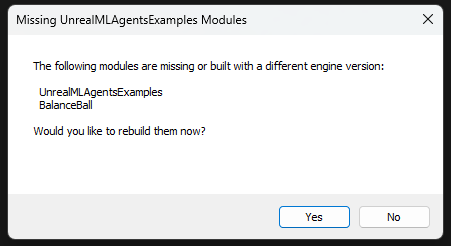
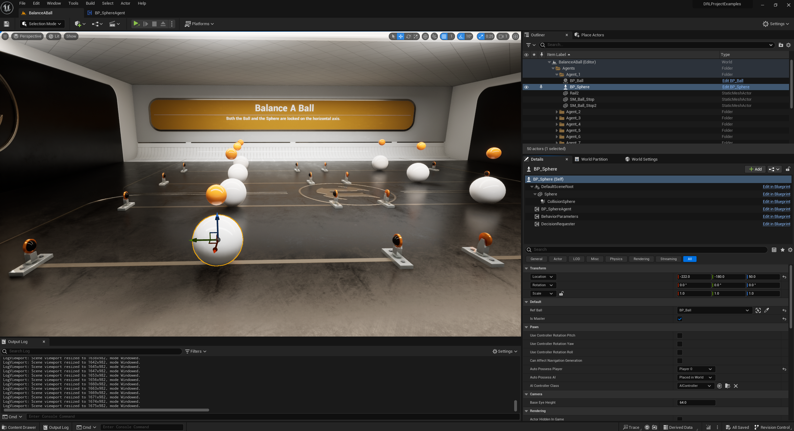
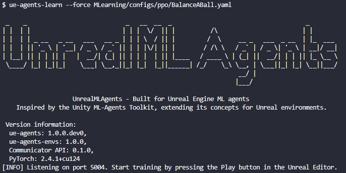
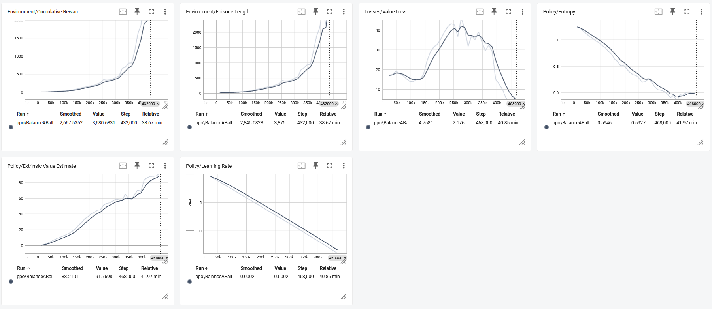

Getting Started
===============

This guide walks through the end-to-end process of setting up an example environment in Unreal Engine and training an
Agent. After reading this tutorial, you should be able to train any of the example environments provided with the plugin.
Whether you're new to reinforcement learning or an experienced user, this guide will help you understand the core
concepts and workflows.

For this guide, we will use the **Balance A Ball** environment. This environment consists of a large sphere balancing a
smaller ball on top. The sphere acts as the agent, and its goal is to prevent the smaller ball from falling by adjusting
its tilt. The training process aims to teach the sphere to maintain balance through trial and error.

.. image:: _images/balance_a_ball.png
   :alt: Balance A Ball Example

.. _installation-getting-started:

Installation
------------

If you haven't already, follow the :doc:`Installation <installation>` instructions.

.. note::

   For those who wants to use the Plugin with GitHub, you will need to follow the advanced installation steps.

.. tab-set::

   .. tab-item:: FAB Marketplace

      From the FAB Marketplace, you will need to install the **UnrealMLAgentsExamples Content**. This package includes the
      example environments required for this guide. Installing this content will automatically install the UnrealMLAgents
      plugin if it is not already installed. Alternatively, you can manually install the plugin as described in the
      installation guide.

      1. Navigate to the `FAB Marketplace <https://www.fab.com/>`_ and search for `UnrealMLAgentsExamples`.
      2. Click **Add to My Library**.
      3. Open Epic Games Launcher and go to the **Unreal Engine -> Library** tab.
      4. Refresh the Fab Library and then **Create Project**.

   .. tab-item:: GitHub

      Alternatively, you can clone the repository directly if you prefer:

      1. Ensure the UnrealMLAgents plugin is installed from the FAB Marketplace or the GitHub repository.
      2. Open a command prompt or terminal and clone the repository:

         .. code-block:: bash

            git clone git@github.com:AlanLaboratory/UnrealMLAgentsExamples.git

      3. Navigate to the cloned repository and Launch the Unreal Engine project.

      .. note::

         In case you are using the GitHub repository, you will need to manually install the UnrealMLAgents plugin.
         Create a folder named `Plugins` in the root of the UnrealMLAgentsExamples project and copy
         the `UnrealMLAgents` folder that you have generated in the installation guide.

.. important::

   When you start the Unreal Engine project, you may see a message telling you that you are missing modules
   or that they are not compiled with the same unreal engine version. If you see this message, click **Yes** to rebuild.

Understanding the Environment
-----------------------------

An agent is an autonomous actor that observes and interacts with an environment.
In Unreal Engine, an environment is a level containing one or more Agent Actors and
the other entities that these agents interact with.

.. note::

   In Unreal Engine, the base object of everything in a level is the **Actor**. The Actor is a container for all the
   components that define its behavior, appearance, and interactions. To see the components that make up an Actor, select
   the Actor in the Level Editor and view its details in the **Details Panel**. This panel shows every component attached
   to the Actor, including its mesh, behavior parameters, and more.

The first thing you may notice after opening the Balance A Ball environment is that it contains not one, but several
sphere agents. Each sphere in the level is an independent agent tasked with balancing a smaller ball. In this example,
there are 8 agents, and they all share the same behavior. This design speeds up training since all agents contribute
data to the learning process in parallel.

Agent
~~~~~

The Agent is the actor that observes and takes actions in the environment. In the Balance A Ball environment, the
Agent components are placed on the eight sphere Actors. The base Agent Actor has a few properties that affect its
behavior:

- **Behavior Parameters** — Every Agent must have a Behavior. The Behavior determines how an Agent makes decisions.
- **Max Step** — Defines how many simulation steps can occur before the Agent's episode ends. In Balance A Ball, an
  Agent restarts when the ball falls, and the max step is set to 0, meaning episodes are not limited by a step count.

Behavior Parameters: Vector Observation Space
~~~~~~~~~~~~~~~~~~~~~~~~~~~~~~~~~~~~~~~~~~~~~

Before making a decision, an Agent collects observations about its state in the world. These observations are represented
as a vector of floating-point numbers containing relevant information for decision-making.

The Behavior Parameters of the Balance A Ball example use a `Space Size` of 6. This means that the feature vector
containing the Agent's observations includes six elements: the Y position of the agent, the ball's relative position to
the sphere in a 2D plane (Y and Z), the angle between the ball and the sphere, and the ball's velocity.

Behavior Parameters: Actions
~~~~~~~~~~~~~~~~~~~~~~~~~~~~

An Agent is given instructions in the form of actions. UnrealMLAgents classifies actions into two types: continuous and
discrete. The Balance A Ball example uses discrete actions, which consist of predefined choices. Specifically, it uses a
`Space Size` of 3: no movement, movement to the left, or movement to the right. These actions are executed by applying a
force on the Y-axis of the sphere to influence the ball's movement.

Training a New Model
--------------------

To train your own model using reinforcement learning:

1. Open a command prompt or terminal.

2. Activate your virtual environment that you created during the installation process.

3. If you cloned the UnrealMLAgents plugin repository, you will directly access to the learning configuration files.
   If you installed the UnrealMLAgentsExamples from the FAB Marketplace, you will need to create a configuration
   file based on the `BalanceABall.yaml <https://github.com/AlanLaboratory/UnrealMLAgents/blob/master/MLearning/configs/ppo/BalanceABall.yaml>`_ configuration file and point to it.

3. Run the following command:

   .. code-block:: bash

      ue-agents-learn MLearning/configs/ppo/BalanceABall.yaml --run-id=MyFirstRun

   - `BalanceABall.yaml`: Training configuration file.
   - `--run-id`: Unique identifier for the training session.

4. When prompted, start the Unreal Engine simulation by clicking **Play**.

If `ue-mlagents-learn` runs correctly and starts training, you should see something like this:

Observing Training Progress
---------------------------

Once you start training using `ue-agents-learn` in the way described in the previous section, you will
see a new `results` directory. To observe the training process in more detail, you can use TensorBoard. From the command line run:

.. code-block:: bash

   tensorboard --logdir results

Then navigate to `http://localhost:6006` in your browser to view the TensorBoard summary statistics. For the purposes of this
section, the most important statistic is `Environment/Cumulative Reward`, which should increase throughout training, eventually
converging close to the optimal reward for the environment.

Additional Resources
--------------------

- Explore the excellent documentation on Unity’s Learning Environments:
   - `Learning Environment Design - Agents <https://github.com/Unity-Technologies/ml-agents/blob/develop/docs/Learning-Environment-Design-Agents.md>`_
   - `General Learning Environment Design <https://github.com/Unity-Technologies/ml-agents/blob/develop/docs/Learning-Environment-Design.md>`_
- For further insights, explore the excellent documentation on Unity’s Learning Environments:
  `Unity ML-Agents Toolkit <https://github.com/Unity-Technologies/ml-agents>`_.

.. _next-steps-getting-started:

Next Steps
----------

- Explore the next section: :doc:`Creating a New Environment </intro/create-new-environment>` to learn how to design your own custom learning scenarios.
- Learn more about our :doc:`examples </intro/examples>` to deepen your understanding of specific environment and training process.
